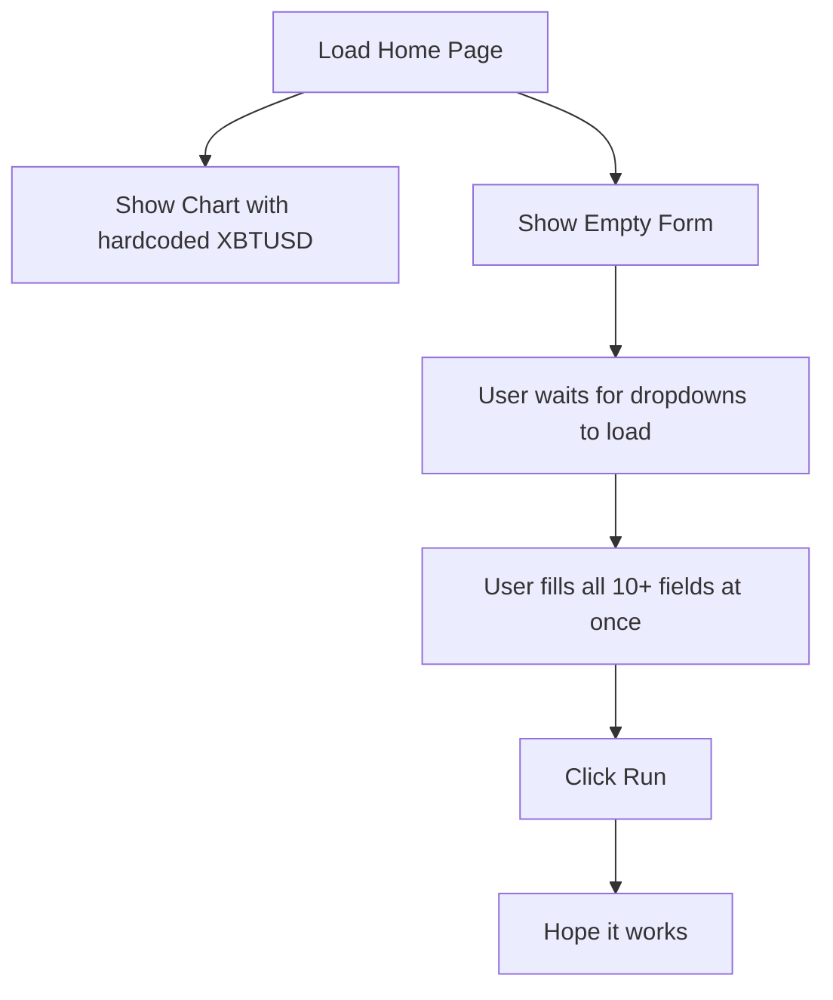
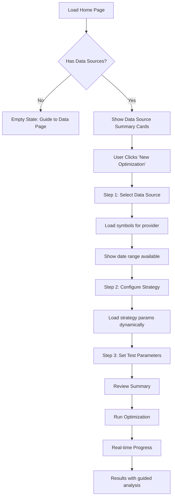
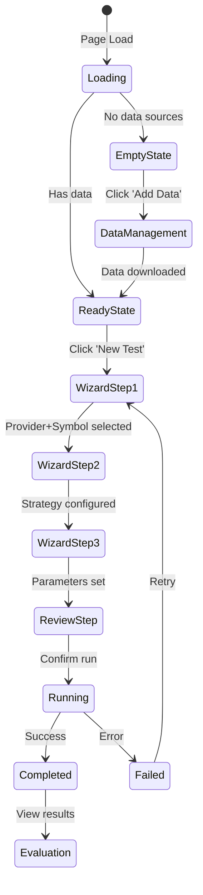
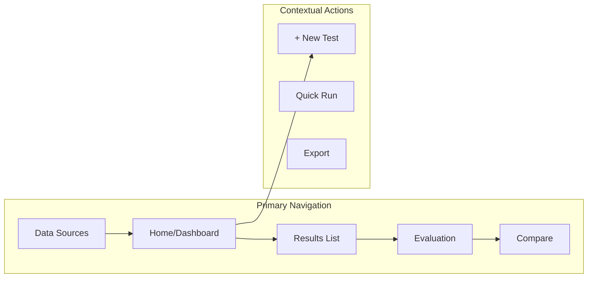
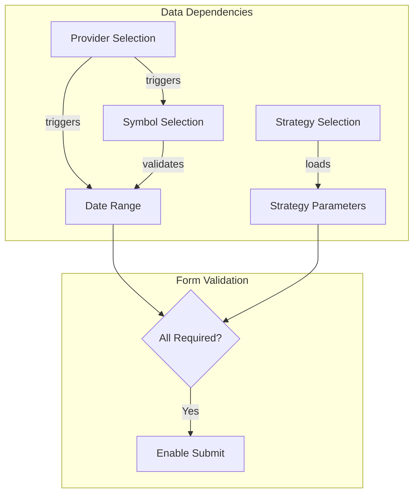

# Maestro UX Redesign - User Flow

## Current vs Proposed Flow

### Current Flow (Problematic)

### Proposed Flow (Improved)

## Screen State Machine

## Navigation Architecture

## Component Dependencies

